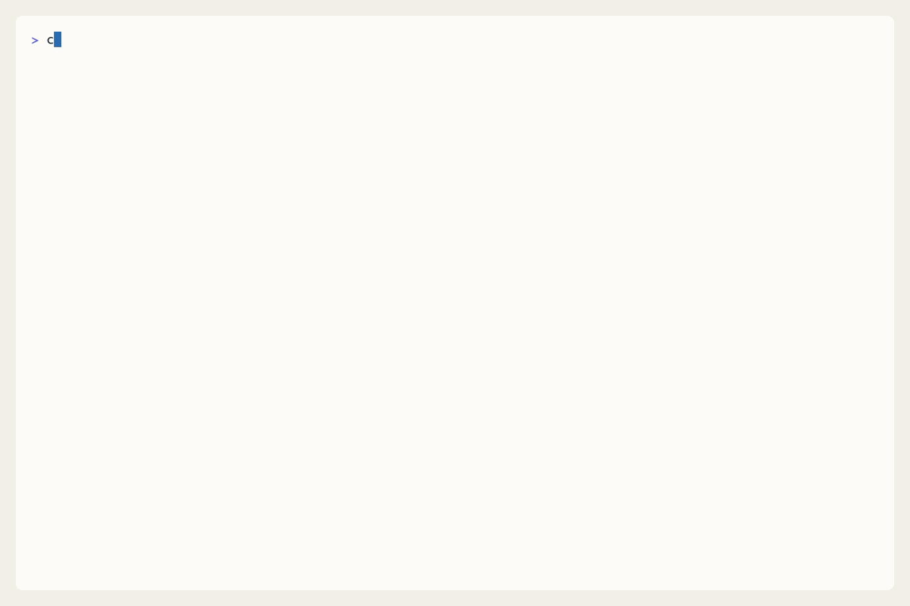

# stack

`stack` is a CLI for stacked pull requests on GitHub.

It helps you split one large change into a chain of smaller dependent PRs, keep
their branch relationships straight, update PR bases when parents move, and hand
the ready bottom PR to GitHub merge queue without turning your repo into
something only one tool understands.




## What stacked PRs are

A stacked PR flow takes one bigger feature and breaks it into a sequence:

- branch A targets `main`
- branch B builds on A and its PR targets A
- branch C builds on B and its PR targets B

That makes review smaller and landing order clearer, but it also creates work:
when A changes or merges, B and C need to move with it.

## What `stack` does

`stack` keeps that workflow explicit and repairable:

- you create or track a branch inside a stack
- you restack branches when parents move
- you submit one normal GitHub PR per branch
- you sync local stack state after merges or GitHub-side changes
- you queue the bottom PR when it is ready

The branches stay ordinary Git branches. The PRs stay ordinary GitHub PRs. If
you stop using `stack`, the repository still looks like a normal repository.

## Merge queue

`stack queue` is for the bottom branch in a healthy stack. It verifies the PR
base, head, and remote state, then hands that PR to GitHub auto-merge or merge
queue. After the merge lands, `stack sync` helps the rest of the stack catch up
without guessing through ambiguous cases.

## How it differs from Graphite and similar tools

`stack` is closest in spirit to tools that keep explicit local stack metadata,
but it is deliberately simple:

- it works with ordinary branches and ordinary GitHub PRs
- it keeps stack intent locally, not in a hosted control plane
- it favors previews, confirmations, and repair loops over hidden automation
- it stays legible even if someone on the team never installs the tool

That makes it a good fit for teams that want stacked PRs on GitHub without
adopting a more opinionated end-to-end workflow.

## Install

```bash
brew tap hack-dance/homebrew-tap
brew install hack-dance/tap/stack
```

More install and source-build options live in [docs/install.md](docs/install.md).

## Quick start

```bash
stack init --trunk main --remote origin
stack create feature/base
stack create feature/child
stack status
stack submit --all
stack queue feature/base
```

For the full daily workflow, start with [docs/usage.md](docs/usage.md).

## Starting from existing PRs

You do not need to start with a clean stack on day one.

If you already have a pile of open PRs, `stack` can still help you turn them
into an explicit stack so you can test them as a composed set, land them in a
clean order, and handle conflicts with less guesswork.

The practical path is:

1. check out the repo locally and make sure you have local branches for the PR heads you care about
2. decide the intended parent chain or grouping
3. run `stack track <branch> --parent <parent>` for each branch
4. run `stack status` and `stack sync` to see what does not match yet
5. use `stack move`, `stack restack`, and `stack submit` to bring the stack into shape

That adoption flow is documented in [docs/adopting-existing-prs.md](docs/adopting-existing-prs.md).

## Documentation

- [docs/README.md](docs/README.md) for the full docs index
- [docs/adopting-existing-prs.md](docs/adopting-existing-prs.md) for grouping and ordering an existing PR set
- [docs/how-it-works.md](docs/how-it-works.md) for the model and workflow
- [docs/usage.md](docs/usage.md) for everyday commands and repair loops
- [docs/troubleshooting.md](docs/troubleshooting.md) for common failure modes
- [docs/cli/stack.md](docs/cli/stack.md) for generated command reference

Contributor docs live in [docs/testing.md](docs/testing.md) and
[docs/releasing.md](docs/releasing.md). The bundled agent skill lives at
[skills/stack-cli/SKILL.md](skills/stack-cli/SKILL.md).
